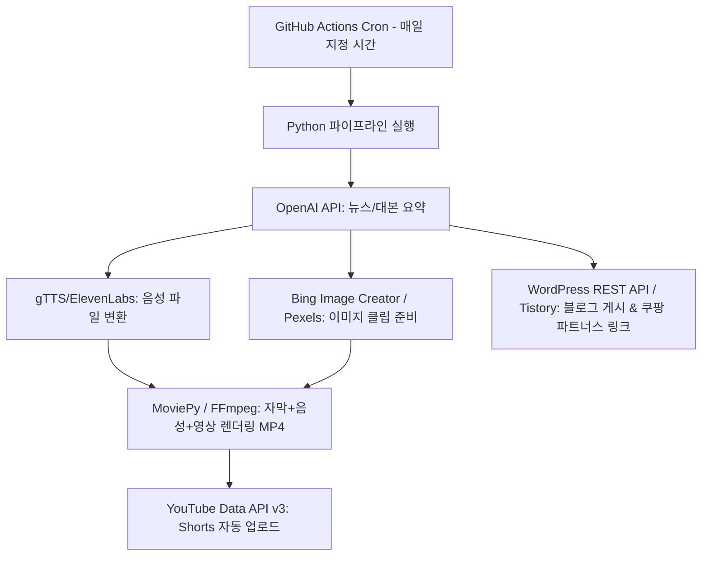

# 🚀 AI 패시브 수익 프로젝트 미래 아카이브 (Roadmap & Ideas)

이 문서는 추후 패시브 수익 파이프라인을 확장할 때 참고하기 위한 백업 가이드북입니다.

---

## 1. 🤖 100% 무인 숏폼 & 블로그 파이프라인 (2번 프로젝트)

서버 비용 $0으로 24시간 매일 자동으로 콘텐츠를 생성 및 게시하여 애드센스 및 제휴 수수료 수익을 창출하는 아키텍처입니다.

### 🛠️ 테크 스택 & 무료 인프라 ($0)
- **무료 스케줄러**: GitHub Actions (`.github/workflows/daily_post.yml`) - 월 2,000분 무료
- **언어 & 라이브러리**: Python 3.10+, `moviepy`, `gTTS`, `requests`, `pillow`
- **콘텐츠 생성 AI**: OpenAI API (GPT-4o-mini, 비용 미미)
- **업로드 연동**: YouTube Data API v3, WordPress REST API

### 📋 주요 구현 단계
1. **GitHub Repository 구성**:
   - `main.py`: 파이프라인 총괄 스크립트
   - `scripts/script_generator.py`: 대본 작성
   - `scripts/video_creator.py`: FFmpeg 기반 MP4 합성
   - `scripts/uploader.py`: OAuth2 인증 후 유튜브/블로그 업로드
2. **Secrets 등록**: `OPENAI_API_KEY`, `YOUTUBE_CLIENT_SECRET` 등을 GitHub Secrets에 저장.
3. **Cron 설정**: 매일 오전 8시 자동 실행 설정 (`cron: '0 23 * * *'`).

---

## 2. 📦 보일러플레이트 / 템플릿 미채택 후보군 백업

### 💡 후보 B. n8n AI 워크플로우 템플릿 팩 (JSON)

코딩 없이 업무 자동화를 원하는 1인 기업/마케터를 위한 무인 워크플로우 템플릿 모음집입니다.

* **타겟 고객**: 마케터, 소상공인, 노코드 구축가
* **권장 가격**: $19 ~ $29
* **포함할 수 있는 워크플로우 JSON 레시피**:
  1. **YouTube 자동 요약본 팩**: 특정 유튜브 채널 신규 영상 감지 ➔ Whisper AI 자막 추출 ➔ Claude 요약 ➔ 슬랙/디스코드 전송
  2. **SNS 카드뉴스 자동화**: 블로그 아티클 입력 ➔ AI 요약 ➔ Canva API / Bannerbear 연동 카드뉴스 이미지 자동 생성
  3. **고객 문의 자동 답변 팩**: Gmail 신규 메일 감지 ➔ RAG AI로 관련 지식베이스 검색 ➔ 답장 초안 자동 작성 후 임시저장
* **판매 팁**: n8n 워크플로우 `.json` 파일과 함께 "5분 만에 내 n8n에 가져오는 법" 1분 데모 영상 첨부.

---

### 💡 후보 C. Chrome Extension AI BYOK Starter Kit (Vite + React)

크롬 확장 프로그램을 빠르게 개발하고 싶은 프론트엔드 개발자용 스타터 킷입니다.

* **타겟 고객**: 크롬 웹스토어에 사이드 프로젝트를 런칭하려는 개발자
* **권장 가격**: $29 ~ $49
* **테크 스택**:
  - `Vite` + `React` + `TypeScript`
  - `Tailwind CSS` + `Shadcn UI`
  - `Chrome Extension Manifest v3` (Popup, Background Service Worker, Content Script 세팅)
  - `Chrome Storage API` (유저의 OpenAI API Key 안전 저장)
* **포함 기능 예시**:
  - 팝업창 UI (API 키 입력 및 모델 선택 옵션)
  - 드래그한 텍스트를 AI로 바로 번역/요약하는 컨텍스트 메뉴(우클릭 메뉴) 연동 코드
  - 웹페이지 본문을 읽어오는 Content Script 모듈
